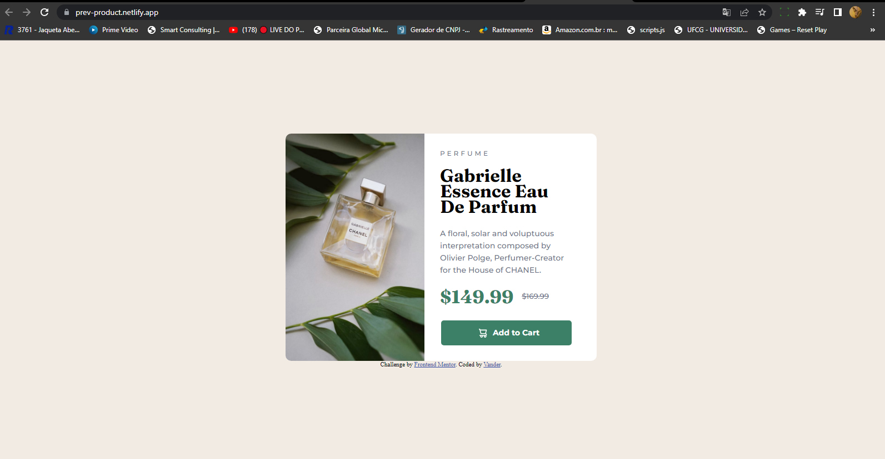

# Quarto-desafio-frontand-mentor
# Frontend Mentor - Product preview card component solution

This is a solution to the [Product preview card component challenge on Frontend Mentor](https://www.frontendmentor.io/challenges/product-preview-card-component-GO7UmttRfa). Frontend Mentor challenges help you improve your coding skills by building realistic projects. 

## Table of contents

- [Overview](#overview)
  - [The challenge](#the-challenge)
  - [Screenshot-Desktop](#screenshot-desktop)
  - [Screenshot-mobile](#screenshot-mobile)
  - [Links](#links)
- [My process](#my-process)
  - [Built with](#built-with)

 ## Overview
 
### Screenshot-Desktop 

### Screenshot-mobile

### Links
-solution url:[solution url](https://prev-product.netlify.app/)

## My process
-HTML
-CSS
-TEGS (<picture> , <source>)
-ATRIBUTOS (srcset="" , media="")

## Built with
Solução com HTML,CSS e com as tegs( <picture>,<source>) e os atributos (srcset="" , media=""), para uma resposta responsiva na troca de imagens de acordo com o tamanho da tela, uma estilização no CSS, com media query , na responsividade de 375px.

